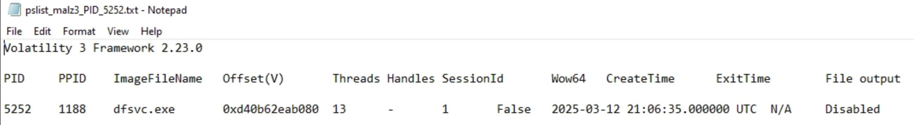
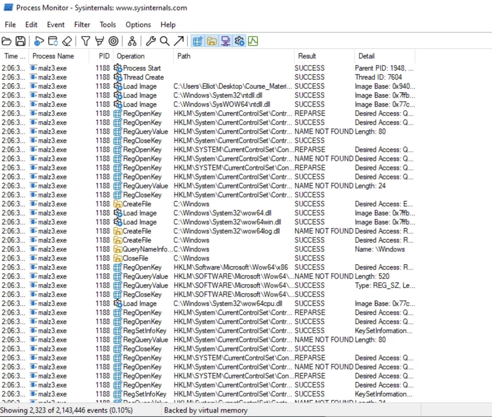
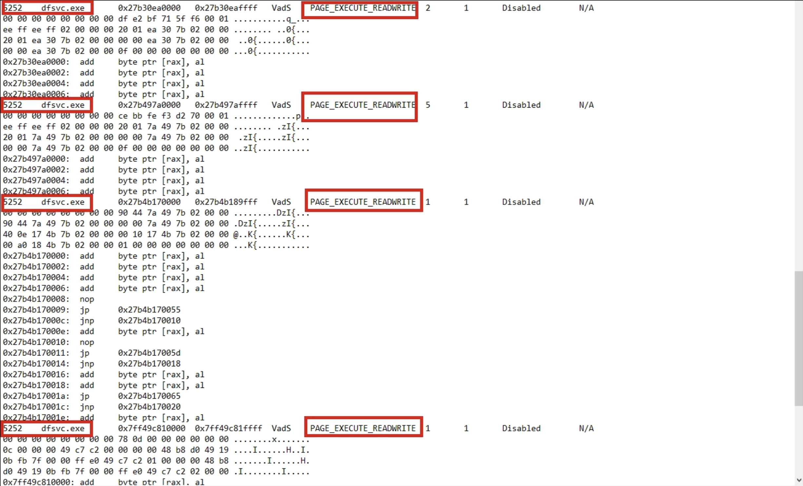
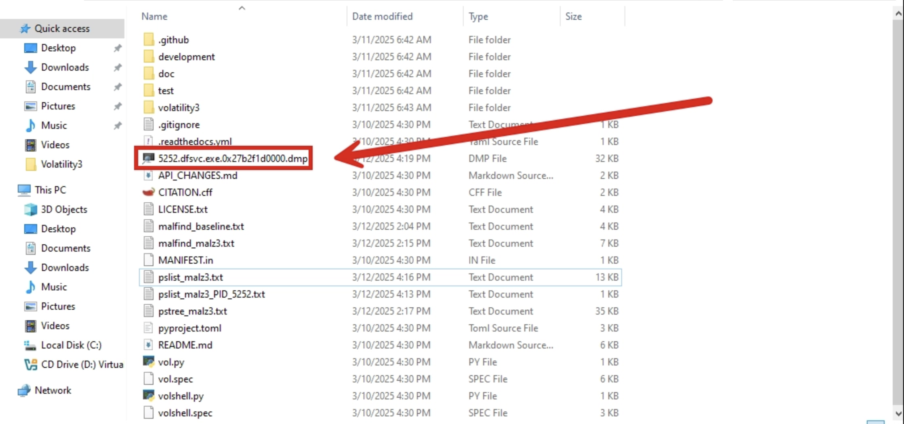
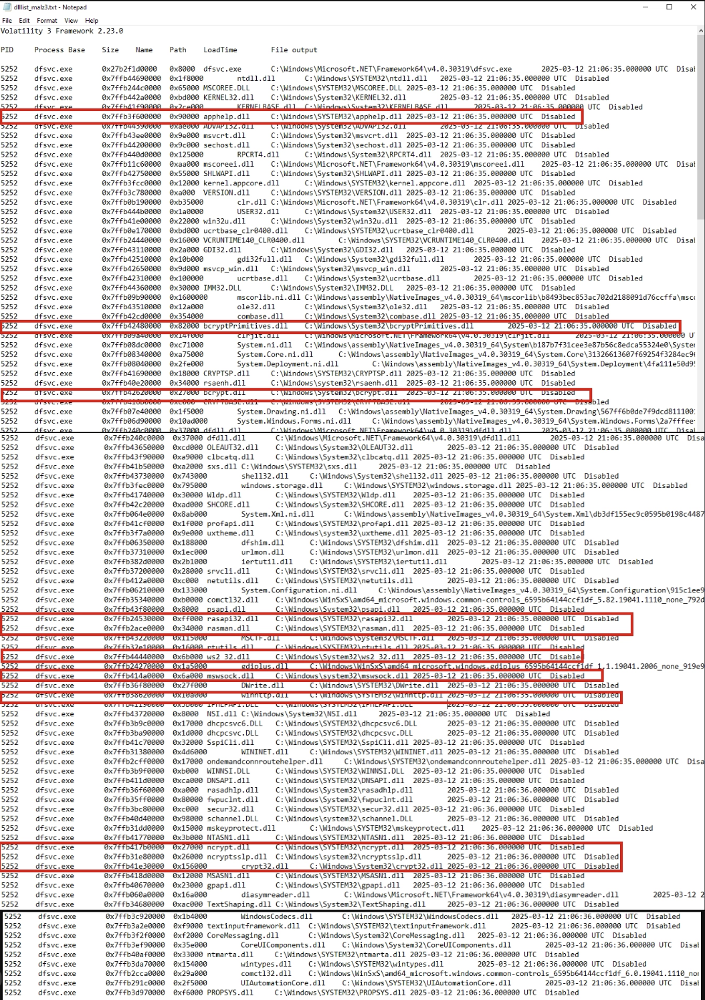
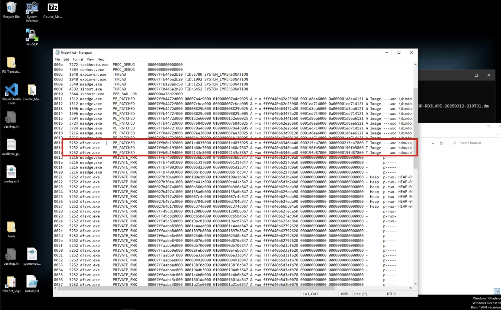
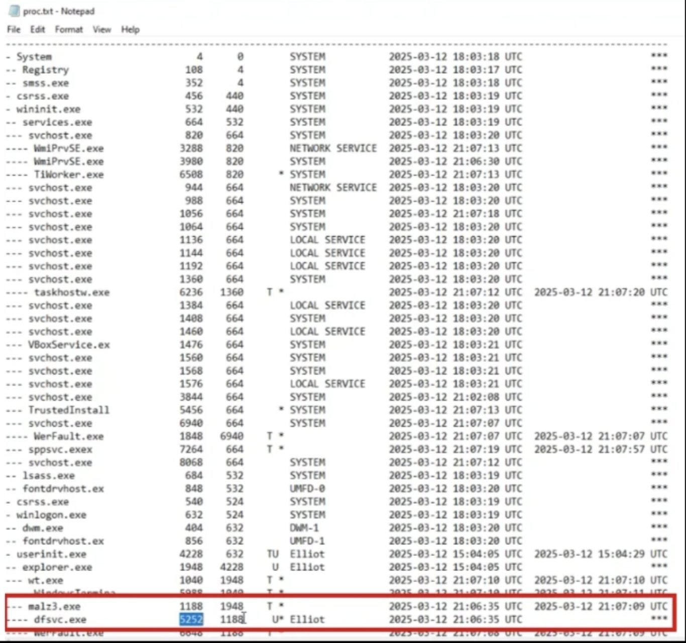
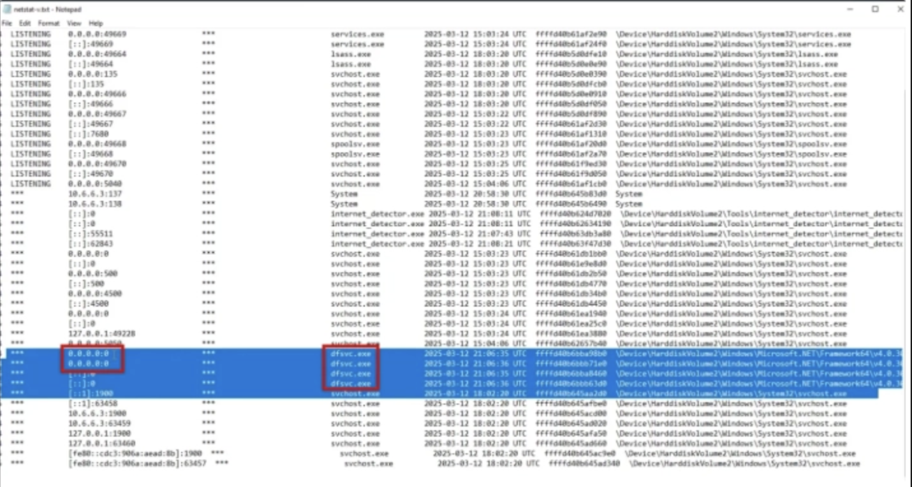

# Memory Forensics Investigation Report

## 1. Executive Overview

This investigation examined a Windows memory image captured during the execution of a suspected malware sample. The objective was to determine whether the captured memory contained evidence of malicious process activity, code injection, abnormal memory allocation, modified executable structures, or suspicious network activity.

The investigation was conducted from a Blue Team / incident response perspective, using memory forensics to identify artifacts that may not be visible through conventional disk-based malware analysis.

The primary analysis was performed using:

- Volatility 3
- MemProcFS
- Procmon for supporting endpoint telemetry

The investigation identified multiple artifacts associated with `dfsvc.exe`, including suspicious executable memory regions, anomalous memory protections, modified PE structures, and network-related artifacts.

The findings were not assessed from a single artifact in isolation. Volatility and MemProcFS results were compared and correlated with supporting process telemetry to establish a stronger evidence chain.

> **Assessment:** The combined memory artifacts provide strong evidence that `dfsvc.exe` was compromised or otherwise involved in malicious activity during the captured execution.

---

# 2. Investigation Scope

The investigation was limited to artifacts available within the captured Windows memory image and supporting host telemetry.

The investigation focused on:

- Process identification and enumeration
- Process parent-child relationships
- Suspicious memory regions
- Potential code injection
- Executable memory protections
- Loaded modules and DLLs
- Modified PE structures
- Network artifacts
- Cross-tool evidence correlation
- Identification of potential Indicators of Compromise (IOCs)

The investigation was not intended to provide a complete malware reverse-engineering analysis of the executable or a comprehensive reconstruction of every activity occurring on the endpoint.

---

# 3. Evidence Sources

The primary evidence source was a Windows memory image captured during malware execution.

Supporting evidence was obtained from endpoint telemetry collected during the associated execution.

| Evidence Source | Role in Investigation |
|---|---|
| Windows Memory Image | Primary forensic evidence |
| Volatility 3 | Process, memory, and module analysis |
| MemProcFS | Independent memory artifact analysis |
| Procmon | Supporting process and host telemetry |
| SHA256 Hash | Evidence integrity validation |

The original memory image is not included in the repository where doing so would create unnecessary repository size or potential malware-handling concerns. Its SHA256 hash and evidence metadata are maintained separately under the `evidence/` directory.

---

# 4. Evidence Integrity

Before analysis, the memory image was validated using a SHA256 hash.

The calculated hash is documented in:

`evidence/memory-image.sha256.txt`

Evidence provenance and supporting metadata are documented in:

`evidence/evidence-manifest.md`

Maintaining the hash separately provides a mechanism for verifying that the forensic image used during analysis has not been unintentionally altered.

---

# 5. Initial Investigative Approach

The investigation followed a progressive analysis model.

The initial objective was to establish what processes were present in the memory image before narrowing the investigation to suspicious activity.

The workflow was:

```text
Memory Image
     │
     ▼
Evidence Validation
     │
     ▼
Process Enumeration
     │
     ▼
Process Relationship Analysis
     │
     ▼
Suspicious Memory Detection
     │
     ▼
Process / Module Investigation
     │
     ▼
Network Artifact Analysis
     │
     ▼
Cross-Tool Correlation
     │
     ▼
IOC Identification
     │
     ▼
Analytical Assessment
```

This approach prevented individual artifacts from being prematurely classified as malicious without additional supporting evidence.

---

# 6. Process Investigation

## 6.1 Process Enumeration

Volatility 3 windows.pslist was used to enumerate processes present within the memory image.

The analysis considered:

* Process name
* Process ID (PID)
* Parent Process ID (PPID)
* Process creation time
* Process relationships
* Processes requiring additional investigation


During the investigation, `dfsvc.exe` was identified as a process requiring further examination.

The process was subsequently investigated using its PID.

Supporting evidence:



Analyst Note: Process enumeration establishes the initial process population but does not by itself establish maliciousness. Suspicion was determined through subsequent memory, process, module, and network analysis.

---

# 7. Process Relationship Analysis

Volatility 3 windows.pstree was used to reconstruct the process hierarchy.

Understanding process ancestry is important during malware investigations because suspicious execution can sometimes be identified through abnormal parent-child relationships.

The investigation identified a PPID associated with the suspicious process. However, the parent process was not present in the reconstructed process tree, indicating that the parent process may have terminated before the memory capture.

Supporting Procmon telemetry was subsequently reviewed to identify the process associated with the PPID.

The Procmon evidence identified PID 1188 as malz3.exe.

This correlation provided additional context for the process execution chain.

Supporting screenshots:

* screenshots/volatility/pstree.png
* screenshots/procmon/procmon-parent-process.png




Analyst Assessment: The absence of the parent process from the memory process tree does not independently indicate malicious behavior. However, correlation with Procmon provided additional evidence for reconstructing the execution chain.

---

# 8. Suspicious Memory Analysis

## 8.1 Malfind Investigation

Volatility 3 windows.malfind was used to identify memory regions exhibiting characteristics associated with potentially injected or executable code.

The analysis identified suspicious memory regions associated with:

dfsvc.exe

Of particular interest were memory regions exhibiting:

PAGE_EXECUTE_READWRITE

A memory region that is simultaneously writable and executable can provide an environment in which dynamically injected code may execute.

However, an RWX memory region alone is not sufficient to classify a process as malicious. Such findings must be evaluated alongside process identity, memory characteristics, process ancestry, loaded modules, and additional endpoint evidence.


Supporting screenshot:


Analyst Assessment

The presence of multiple suspicious executable/writable memory regions within dfsvc.exe increased the priority of the process for further investigation.

The process was therefore examined through additional memory and module analysis rather than treating the malfind result as a standalone detection.

---

# 9. Target Process Investigation

The investigation focused on dfsvc.exe, identified with PID 5252.

Volatility 3 was used to obtain additional process-level information for the identified PID.

The process was also dumped from memory for potential subsequent malware analysis.

The extraction was performed using the process PID:

```bash
vol.py -f <memory-image> windows.pslist --pid 5252 --dump
```


The resulting process artifact can be subjected to additional static and behavioral analysis where required.

Supporting screenshot:


**Analyst** Note: Extracting a process from memory can provide access to executable content or artifacts that may differ from the corresponding file originally present on disk.


# 10. Loaded Module Analysis

Volatility 3 windows.dlllist was used to examine modules loaded by PID 5252.

The analysis focused on identifying:

* Unexpected modules
* Module paths
* Network-related libraries
* Cryptographic libraries
* Modules requiring contextual review
* Relationships between loaded modules and the suspicious process


Supporting screenshot:

screenshots/volatility/volatility-dlllist-loaded-modules.png


Several DLLs were identified as worthy of contextual review, including:

* apphelp.dll
* rasapi32.dll
* rasman.dll
* mswsock.dll
* winhttp.dll
* ws2_32.dll
* bcrypt.dll
* bcryptPrimitives.dll
* ncrypt.dll
* ncryptsslp.dll
* crypt32.dll
* dfdll.dll

These modules were not automatically classified as malicious.

Several are legitimate Windows components with networking, cryptographic, application compatibility, or .NET functionality.

Their significance comes from their presence within the broader context of a process that had already exhibited suspicious memory characteristics.

Analyst Assessment: DLL presence alone is insufficient to establish compromise. The modules were therefore evaluated as supporting context rather than primary evidence of malicious activity.

---

# 11. MemProcFS Investigation

MemProcFS was used as an independent analysis framework to provide an additional view of the memory image.

The purpose of using a second framework was to determine whether observations made through Volatility could be corroborated through an alternative representation of the same memory evidence.

---

# 12. MemProcFS FindEvil Analysis

The MemProcFS forensic findevil output was examined for suspicious memory artifacts.

The analysis identified dfsvc.exe within the suspicious-memory findings.

This observation was significant because it provided independent support for the Volatility malfind result.


Supporting screenshot:




# Cross-Tool Correlation

The correlation can be represented as:

```text
Volatility malfind
       │
       ▼
Suspicious memory associated with dfsvc.exe
       │
       ▼
MemProcFS FindEvil
       │
       ▼
dfsvc.exe identified again
       │
       ▼
Increased confidence in finding
```
**Analyst Assessment:** Agreement between independent memory-analysis frameworks increased confidence that the suspicious memory characteristics associated with dfsvc.exe were not solely the result of one tool’s interpretation.

# 13. PE Modification Evidence

MemProcFS identified a PE_PATCHED condition associated with the investigated process.

PE_PATCHED indicates that characteristics of the process’s Portable Executable structure differ from the expected original PE structure.

In the context of this investigation, this finding was considered significant because it occurred alongside previously identified suspicious executable memory regions.

However, PE modification alone does not establish the exact mechanism used to modify the process.

Further reverse engineering would be required to conclusively determine whether the modification resulted from process injection, runtime patching, malware execution, or another mechanism.

Supporting screenshot:


---

# 14. MemProcFS Process Analysis

The MemProcFS process artifacts were reviewed to provide an additional representation of the process hierarchy.


The comparison was performed to identify consistency between the two frameworks and to provide additional context around the suspicious process.

Supporting screenshot:



---

# 15. Network Artifact Investigation

Network artifacts were examined through MemProcFS to determine whether the memory image preserved evidence of network activity associated with the investigated process.


The analysis considered:

* Local addresses
* Remote addresses
* Ports
* Process associations
* Listening states
* Connection states

The investigation identified network-related activity associated with dfsvc.exe that warranted further examination.

A notable artifact was the presence of a binding represented as:

0.0.0.0:0

This observation was treated as suspicious in the context of the other findings rather than as standalone proof of C2 activity.

Potential explanations considered included:

* Backdoor functionality
* Command-and-control infrastructure
* Proxy or tunneling behavior
* Other network-related process behavior

Supporting screenshot:


screenshots/memprocfs/memprocfs-netstat-network-artifacts.png

Analyst Assessment: Network artifacts increased the investigative significance of dfsvc.exe, particularly when considered alongside suspicious memory regions and PE modification evidence.

---

# 16. Evidence Correlation

The investigation relied on correlation rather than isolated tool output.

The primary evidence chain developed during the investigation was:

```text

dfsvc.exe
   │
   ├── PID 5252
   │
   ├── Suspicious RWX memory regions
   │
   ├── Volatility malfind detection
   │
   ├── MemProcFS FindEvil detection
   │
   ├── PE_PATCHED indicator
   │
   ├── Loaded network-related modules
   │
   └── Network artifact requiring investigation
```
Supporting process telemetry provided additional context around the process ancestry.

The convergence of multiple independent observations increased confidence that dfsvc.exe required incident-response-level attention.

# 17. Findings

The investigation produced the following principal findings.

Finding 1 — Suspicious Memory Regions

dfsvc.exe contained memory regions exhibiting characteristics associated with potentially injected or dynamically executed code.

Evidence:

* Volatility malfind
* RWX memory regions

Confidence: High

---

Finding 2 — Cross-Tool Confirmation

The suspicious process was identified through both Volatility and MemProcFS analysis.

* volatility
* memprocfs

Confidence: High

---

Finding 3 — Modified PE Structure

MemProcFS reported a PE_PATCHED condition associated with the investigated process.

Evidence:

* MemProcFS forensic output

Confidence: Medium–High

This finding supports the broader compromise hypothesis but does not independently identify the exact modification mechanism.

---

Finding 4 — Suspicious Network Artifact

Network artifacts associated with the investigation warranted further review.

The observed network state was evaluated in the context of the suspicious process and other memory artifacts.

Confidence: Medium

Additional packet capture, DNS telemetry, firewall logs, or EDR telemetry would be required to conclusively establish C2 communication.

---

# 18. Indicators of Compromise

Indicators identified during the investigation should be maintained separately from the narrative report.


Potential indicators include:

* Process names
* Process IDs
* File paths
* DLLs
* Hashes
* Registry artifacts


Potential indicators include:

* IP addresses
* Domains
* Ports
* Network connections
* Other network artifacts recovered from memory

Only artifacts supported by the available evidence should be classified as IOCs.

---

# 19. MITRE ATT&CK Considerations

The observed behavior is consistent with several ATT&CK-relevant concepts, particularly around process injection and execution within legitimate processes.

However, ATT&CK mappings should only be assigned where the evidence supports the technique.

The current evidence supports investigation of:

* T1055 — Process Injection

Additional technique mappings should be established only after confirming the specific mechanism used.

For example, the current evidence does not by itself establish a specific process-injection sub-technique such as Process Hollowing or Portable Executable Injection.

---

# 20. Detection and Response Opportunities

The investigation provides several opportunities for defensive detection and response.

Endpoint Detection

Security monitoring should prioritize:

* RWX memory allocations in unusual processes
* Executable memory regions inconsistent with normal process behavior
* PE modification indicators
* Suspicious process ancestry
* Unexpected network activity from normally non-network-facing processes

Memory Forensics

Memory acquisition should be considered when:

* Malware is suspected but disk artifacts are inconclusive
* Process injection is suspected
* Fileless execution is suspected
* EDR telemetry indicates suspicious process behavior
* Network activity cannot be adequately explained through disk artifacts

Threat Hunting

The observed characteristics could be translated into hunting hypotheses around:

# 21. Limitations

Several limitations should be considered when interpreting the findings.

1. The investigation was performed against a captured memory image rather than a live endpoint.
2. Some processes may have terminated before memory acquisition.
3. Memory artifacts can provide strong behavioral evidence but may not preserve the complete execution history.
4. Network artifacts recovered from memory do not necessarily establish successful external communication.
5. The presence of legitimate Windows DLLs does not independently indicate malicious activity.
6. RWX memory regions are suspicious but are not inherently malicious.
7. Additional endpoint, network, and malware reverse-engineering evidence would be required to reconstruct the complete attack chain.

These limitations were considered when assigning confidence to the findings.

---

# 22. Analyst Assessment

The combined evidence indicates that `dfsvc.exe` warrants classification as a high-priority suspicious process within the investigated execution environment.

The strongest evidence consists of the convergence of:

* Suspicious executable/writable memory regions
* Volatility malfind detection
* MemProcFS FindEvil detection
* PE_PATCHED evidence
* Supporting process telemetry
* Network artifacts requiring investigation

No single artifact was treated as conclusive in isolation.

The assessment is instead based on the correlation of multiple independent observations from the same memory image and supporting telemetry.

Overall Assessment: The evidence is consistent with compromise of `dfsvc.exe` and potential in-memory execution or process manipulation. Further analysis of the dumped process, endpoint telemetry, and network evidence would be required to determine the precise injection mechanism, malware family, persistence mechanism, and external infrastructure involved.

---

# 23. Recommended Next Steps

If this investigation were conducted as part of a live incident-response engagement, the following actions would be recommended:

1. Isolate the affected endpoint if compromise is confirmed.
2. Preserve the original forensic image and associated evidence.
3. Hash and preserve any extracted process artifacts.
4. Perform static analysis of the dumped process.
5. Perform dynamic analysis in an isolated malware-analysis environment.
6. Review EDR telemetry for process injection and memory allocation events.
7. Investigate DNS, proxy, firewall, and network telemetry.
8. Search the environment for the identified process and related artifacts.
9. Hunt for matching hashes, paths, modules, and network indicators.
10. Determine whether persistence mechanisms exist on the endpoint.
11. Identify the initial execution vector.
12. Document confirmed IOCs for detection and containment.


# 24. Evidence Inventory

| Artifact | Location | Purpose |
|---|---|---|
| Process enumeration | `volatility/pslist.txt` | Process analysis |
| Process tree | `volatility/pstree.txt` | Process ancestry |
| Malfind output | `volatility/malfind.txt` | Suspicious memory detection |
| DLL list | `volatility/dlllist.txt` | Module analysis |
| FindEvil output | `memprocfs/forensic-findevil.txt` | Independent memory validation |
| MemProcFS process tree | `memprocfs/process-tree.txt` | Process correlation |
| Network artifacts | `memprocfs/netstat.txt` | Network investigation |
| Host IOCs | `iocs/host-iocs.csv` | IOC tracking |
| Network IOCs | `iocs/network-iocs.csv` | Network IOC tracking |
| Memory hash | `evidence/memory-image.sha256.txt` | Integrity validation |

---

# 25. Conclusion

This investigation demonstrates the value of memory forensics as a component of modern Blue Team and incident-response investigations.

The analysis moved from broad process enumeration to targeted investigation of `dfsvc.exe`, followed by memory analysis, module analysis, independent MemProcFS validation, and network artifact review.

The most significant observation was not an individual Volatility or MemProcFS output, but the correlation between multiple artifacts:

```text
Suspicious Process
       │
       ▼
RWX Memory
       │
       ▼
Malfind Detection
       │
       ▼
MemProcFS FindEvil
       │
       ▼
PE Modification
       │
       ▼
Network Artifact
       │
       ▼
Correlated Suspicion
```
This approach reflects an evidence-driven Blue Team methodology: identify an anomaly, collect supporting evidence, correlate independent artifacts, assess confidence, and translate the findings into actionable detection and response opportunities.

Memory forensics therefore serves as an important investigative layer when traditional file-based analysis or endpoint telemetry does not provide sufficient visibility into malicious execution.
